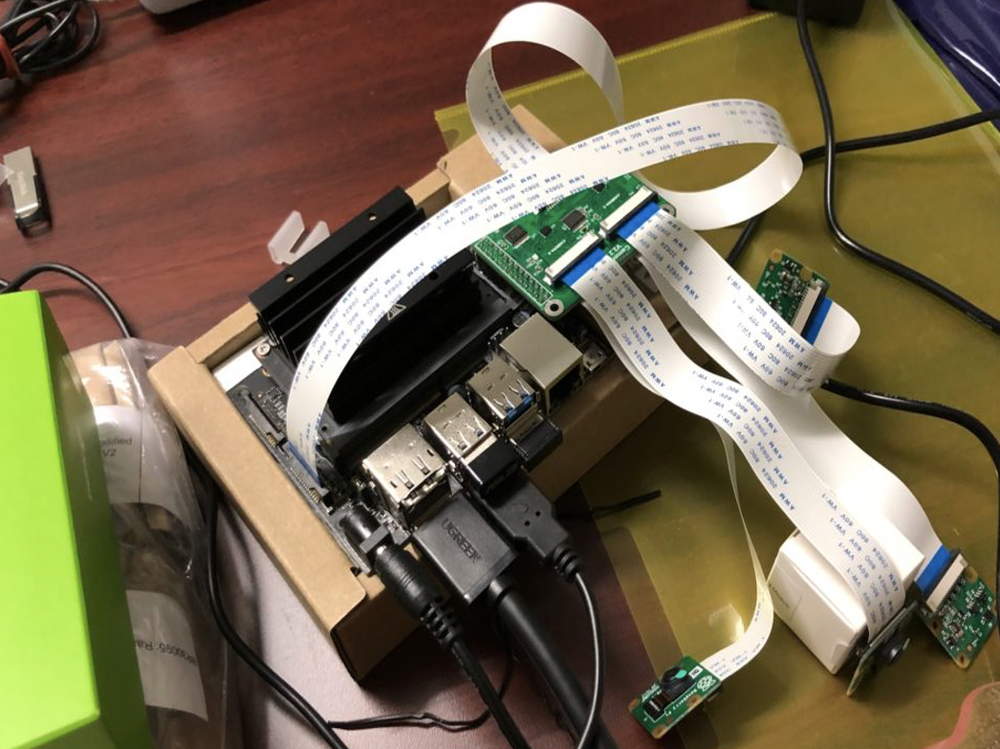

# **Jetson Nano for YOLOv4**



## **USB WiFi Adapters**

Install Linux Driver for USB WiFi Adapters that are based on the `RTL8812BU` and `RTL8822BU` Chipsets, you can download via https://drive.google.com/file/d/1LQwL-IdImwEagkEoZnkw4Ilf6fjKkzki

The version of the driver is `5.8.7.4`.

Unzip it and go to inside the directory then follow the instruction below :

```bash
$ sudo ARCH=arm64 make
$ sudo make install
# Reboot your Jetson Nano
$ reboot
```

After that enjoy your WiFi!!!.

## **Setup swap memory**

Normally, Jetson Nano provides memory around 4GB, it has not enough to do object detection and image classification. It didn't provide swap memory too. So we need to prepare it manually.

In this case I have micro-SD card 128GB, so I set swap memory to 25GB(minimum should be around 4GB):

```bash
mkdir -p ${HOME}/project
cd ${HOME}/project
git clone https://github.com/jkjung-avt/jetson_nano.git
cd jetson_nano/
./install_basics.sh

sudo fallocate -l 25G /mnt/25GB.swap
sudo mkswap /mnt/25GB.swap
sudo swapon /mnt/25GB.swap
```

then adding config below to `/etc/fstab` :

```
/mnt/25GB.swap  none  swap  sw 0  0
```

## **Install & Update**

You can install all dependencies manually by following the instruction below, or you can install via [`install.sh`](./install.sh).

### Common use

```bash
$ sudo apt install ntp nano htop
```

### **TensorRT** on **JetPack4.4** for Object detection

```bash
### Install dependencies for python3 "cv2"
sudo apt update
sudo apt install -y build-essential make cmake cmake-curses-gui \
                      git g++ pkg-config curl libfreetype6-dev \
                      libcanberra-gtk-module libcanberra-gtk3-module \
                      python3-dev python3-pip
sudo pip3 install -U pip==20.2.1 Cython testresources setuptools
cd ${HOME}/project/jetson_nano
./install_protobuf-3.8.0.sh
sudo pip3 install numpy==1.16.1 matplotlib==3.2.2

### Test tegra-cam.py (using a USB webcam)
cd ${HOME}/project
wget https://gist.githubusercontent.com/jkjung-avt/86b60a7723b97da19f7bfa3cb7d2690e/raw/3dd82662f6b4584c58ba81ecba93dd6f52c3366c/tegra-cam.py
# python3 tegra-cam.py --usb --vid 0

sudo apt install -y libhdf5-serial-dev hdf5-tools libhdf5-dev zlib1g-dev \
                      zip libjpeg8-dev liblapack-dev libblas-dev gfortran
sudo pip3 install -U numpy==1.16.1 future==0.18.2 mock==3.0.5 h5py==2.10.0 \
                       keras_preprocessing==1.1.1 keras_applications==1.0.8 \
                       gast==0.2.2 futures pybind11
sudo pip3 install --pre --extra-index-url \
                    https://developer.download.nvidia.com/compute/redist/jp/v44 \
                    tensorflow==1.15.2

### Clone the tensorrt_demos code
cd ${HOME}/project
git clone https://github.com/jkjung-avt/tensorrt_demos.git
###
### Build TensorRT engine for GoogLeNet
cd ${HOME}/project/tensorrt_demos/googlenet
make
./create_engine
###
### Build TensorRT engines for MTCNN
cd ${HOME}/project/tensorrt_demos/mtcnn
make
./create_engines
###
### Build the "pytrt" Cython module
cd ${HOME}/project/tensorrt_demos
sudo pip3 install Cython
make

### Install dependencies and build TensorRT engines
cd ${HOME}/project/tensorrt_demos/ssd
./install.sh
./build_engines.sh

### Install dependencies and build TensorRT engine
sudo pip3 install onnx==1.4.1
cd ${HOME}/project/tensorrt_demos/plugins
make
cd ${HOME}/project/tensorrt_demos/yolo
./download_yolo.sh
```

### **VSCode**

```bash
$ git clone https://github.com/JetsonHacksNano/installVSCode.git
$ cd installVSCode
$ ./installVSCode.sh
```

### Jetson Inference for Image Classification

I using `jetson.inference` and `jetson.utils` to do image classification but we need to build from source code of [`jetson-inference`](https://github.com/dusty-nv/jetson-inference), please follow instruction below:

```bash
cd ~/project
git clone --recursive https://github.com/dusty-nv/jetson-inference
cd jetson-inference
mkdir build
cd build
cmake ../
make
sudo make install
sudo ldconfig

# Test
cd ~/project
mkdir -p my-recognition-python
cd my-recognition-python
touch my-recognition.py
chmod +x my-recognition.py
wget https://github.com/dusty-nv/jetson-inference/raw/master/data/images/black_bear.jpg 
wget https://github.com/dusty-nv/jetson-inference/raw/master/data/images/brown_bear.jpg
wget https://github.com/dusty-nv/jetson-inference/raw/master/data/images/polar_bear.jpg

printf """
#!/usr/bin/python3

import jetson.inference
import jetson.utils

import time
import argparse

# parse the command line
parser = argparse.ArgumentParser()
parser.add_argument('filename', type=str, help='filename of the image to process')
parser.add_argument('--network', type=str, default='googlenet', help='model to use, can be:  googlenet, resnet-18, ect.')
args = parser.parse_args()

# load an image (into shared CPU/GPU memory)
img = jetson.utils.loadImage(args.filename)

load_net_stime = time.perf_counter()

# load the recognition network
net = jetson.inference.imageNet(args.network)

load_net_etime = time.perf_counter()

print('Load network take time around {} seconds'.format(load_net_etime-load_net_stime))

pred_stime = time.perf_counter()

# classify the image
class_idx, confidence = net.Classify(img)

# find the object description
class_desc = net.GetClassDesc(class_idx)

pred_etime = time.perf_counter()

# print out the result
print('image is recognized as \'{:s}\' (class #{:d}) with {:f} percent confidence'.format(class_desc, class_idx, confidence * 100))
print('Predict take time around {} seconds'.format(pred_etime-pred_stime))
""" >> ~/project/my-recognition-python/my-recognition.py
```

## **Checking inference in image classification**

test inference :

```bash
$ python3 ~/project/my-recognition-python/my-recognition.py \
--network=resnet-50 ~/project/my-recognition-python/black_bear.jpg
```

In case your image is in byte format(from `PIL.Image` or `cv2.imread`), you must convert it into array by `numpy` then using `jetson.utils.cudaFromNumpy` to send the image into CUDA memory :

 - **model_path** : any pre-trained model in `*.onnx` file format.
 - **labels** : provides class name in `*.txt` file format.

```python
import jetson.inference
import jetson.utils
import numpy as np

net = jetson.inference.imageNet('resnet50', [ 
    '--model={}'.format(model_path), 
    '--input_blob=input_0', 
    '--output_blob=output_0', 
    '--labels={}'.format(labels)
])

def predict(self, img):
    # add image to cuda image
    img = np.array(img)
    img = jetson.utils.cudaFromNumpy(img)
    # classify the image
    class_id, confidence = net.Classify(img)
    # find the object description
    class_desc = net.GetClassDesc(class_id)
    return class_desc
```

Now you are ready for implementing image classification.

## **Checking camera**

Using GStreamer :

```bash
$ gst-launch-1.0 nvarguscamerasrc sensor_id=0 ! \
   'video/x-raw(memory:NVMM),width=1280, height=720, framerate=60/1, format=NV12' ! \
   nvvidconv flip-method=0 ! 'video/x-raw,width=1280, height=720' ! \
   nvvidconv ! nvegltransform ! nveglglessink -e
```

> In case your program was hang, it may impact with your camera service you can use command below to refresh your camera :
> ```bash
> $ sudo systemctl restart nvargus-daemon
> ```
> ---

## **Checking inference in object detection**

Before start, I using YOLOv4, you need to convert file format `*.weight` from Darknet into `*.onnx` then convert `*.onnx` to `*.trt` first :

`Dartnet` to `ONNX`:

```bash
$ cd ${HOME}/project/tensorrt_demos/yolo
$ python3 yolo_to_onnx.py -m yolov4-416

# In case you use custom model:
#  - "yolo_to_onnx.py" requires your file name contain yolo version. 
#  - You can set number of class via "--category_num".
$ python3 yolo_to_onnx.py -m yolov4-{YOUR_MODEL_NAME}-416 --category_num {NUMBER_OF_CLASS}
```

`ONNX` to `TensorRT`:

```bash
$ python3 onnx_to_tensorrt.py -m yolov4-416 -v

# In case you use custom model:
$ python3 onnx_to_tensorrt.py -m yolov4-{YOUR_MODEL_NAME}-416 --category_num {NUMBER_OF_CLASS} -v
```

Now you ready to run it :

```bash
$ cd ${HOME}/project/tensorrt_demos && \
python3 trt_yolo.py --onboard 0 -m yolov4-416

# In case you use custom model:
$ cd ${HOME}/project/tensorrt_demos && \
python3 trt_yolo.py --onboard 0 -m yolov4-{YOUR_MODEL_NAME}-416 --category_num {NUMBER_OF_CLASS}
```

## **Training data**

I split to 2-parts:

 - Image classification based on `RestNet50` with `Mish` activation layer.
 - Object detection based on `YOLOv4`.

### **Image classification**

In this part, I using `ResNet50` network to train custom dataset but I modified activation layer from `ReLu` to `Mish` function in `train-mish.py`, see more detail [here](https://github.com/patharanordev/pytorch-classification).

For dataset, you must set directory structure look like this:

```
data
‣ MODEL_NAME
    ‣ labels.txt
    ‣ train/
        • background/
        • brontosaurus/
        • tree/
        • triceratops/
        • velociraptor/
    ‣ val/
        • background/
        • brontosaurus/
        • tree/
        • triceratops/
        • velociraptor/
    ‣ test/
        • background/
        • brontosaurus/
        • tree/
        • triceratops/
        • velociraptor/
```

Your `labels.txt` contains class name same as above directory structure :

```
background
brontosaurus
tree
triceratops
velociraptor
```

If ready, let's start:

```bash
$ python3 train-mish.py \
--arch=resnet50 \
--model-dir=models/{MODEL_NAME} data/{MODEL_NAME}


...
saved checkpoint to:  models/fruit_apple/checkpoint.pth.tar
Epoch: [34][  0/200]  Time  0.387 ( 0.387)  Data  0.333 ( 0.333)  Loss 3.8294e-03 (3.8294e-03)  Acc@1 100.00 (100.00)  Acc@5 100.00 (100.00)
Epoch: [34][ 10/200]  Time  0.064 ( 0.085)  Data  0.000 ( 0.032)  Loss 1.0013e-01 (3.0967e-02)  Acc@1 100.00 ( 98.86)  Acc@5 100.00 (100.00)
Epoch: [34][ 20/200]  Time  0.045 ( 0.084)  Data  0.000 ( 0.031)  Loss 2.6326e-03 (2.7117e-02)  Acc@1 100.00 ( 98.81)  Acc@5 100.00 (100.00)
Epoch: [34][ 30/200]  Time  0.136 ( 0.081)  Data  0.073 ( 0.026)  Loss 6.3973e-02 (3.4044e-02)  Acc@1 100.00 ( 98.39)  Acc@5 100.00 (100.00)
Epoch: [34][ 40/200]  Time  0.049 ( 0.079)  Data  0.002 ( 0.023)  Loss 1.2422e-02 (3.8844e-02)  Acc@1 100.00 ( 97.87)  Acc@5 100.00 (100.00)
Epoch: [34][ 50/200]  Time  0.041 ( 0.073)  Data  0.000 ( 0.019)  Loss 3.6871e-02 (3.6543e-02)  Acc@1 100.00 ( 98.04)  Acc@5 100.00 (100.00)
Epoch: [34][ 60/200]  Time  0.038 ( 0.070)  Data  0.000 ( 0.017)  Loss 4.6071e-03 (3.3784e-02)  Acc@1 100.00 ( 98.36)  Acc@5 100.00 (100.00)
Epoch: [34][ 70/200]  Time  0.066 ( 0.071)  Data  0.000 ( 0.018)  Loss 2.7827e-03 (5.7837e-02)  Acc@1 100.00 ( 97.89)  Acc@5 100.00 (100.00)
Epoch: [34][ 80/200]  Time  0.037 ( 0.070)  Data  0.000 ( 0.017)  Loss 3.3990e-02 (5.2529e-02)  Acc@1 100.00 ( 98.15)  Acc@5 100.00 (100.00)
Epoch: [34][ 90/200]  Time  0.050 ( 0.069)  Data  0.000 ( 0.017)  Loss 2.1990e-03 (5.3662e-02)  Acc@1 100.00 ( 97.94)  Acc@5 100.00 (100.00)
Epoch: [34][100/200]  Time  0.087 ( 0.070)  Data  0.008 ( 0.016)  Loss 5.6163e-03 (5.5847e-02)  Acc@1 100.00 ( 98.02)  Acc@5 100.00 (100.00)
Epoch: [34][110/200]  Time  0.036 ( 0.069)  Data  0.000 ( 0.015)  Loss 2.8448e-03 (5.2946e-02)  Acc@1 100.00 ( 98.20)  Acc@5 100.00 (100.00)
Epoch: [34][120/200]  Time  0.039 ( 0.068)  Data  0.000 ( 0.015)  Loss 6.3611e-02 (5.4446e-02)  Acc@1 100.00 ( 98.04)  Acc@5 100.00 (100.00)
Epoch: [34][130/200]  Time  0.037 ( 0.068)  Data  0.000 ( 0.015)  Loss 6.9871e-02 (5.1419e-02)  Acc@1 100.00 ( 98.19)  Acc@5 100.00 (100.00)
Epoch: [34][140/200]  Time  0.048 ( 0.068)  Data  0.000 ( 0.015)  Loss 4.9016e-03 (4.9348e-02)  Acc@1 100.00 ( 98.32)  Acc@5 100.00 (100.00)
Epoch: [34][150/200]  Time  0.163 ( 0.069)  Data  0.015 ( 0.015)  Loss 3.8899e-03 (4.7614e-02)  Acc@1 100.00 ( 98.43)  Acc@5 100.00 (100.00)
Epoch: [34][160/200]  Time  0.063 ( 0.069)  Data  0.000 ( 0.014)  Loss 3.5615e-03 (5.0477e-02)  Acc@1 100.00 ( 98.21)  Acc@5 100.00 (100.00)
Epoch: [34][170/200]  Time  0.051 ( 0.069)  Data  0.000 ( 0.014)  Loss 4.3249e-03 (5.2344e-02)  Acc@1 100.00 ( 98.17)  Acc@5 100.00 (100.00)
Epoch: [34][180/200]  Time  0.069 ( 0.069)  Data  0.000 ( 0.014)  Loss 6.3234e-02 (5.3205e-02)  Acc@1 100.00 ( 98.14)  Acc@5 100.00 (100.00)
Epoch: [34][190/200]  Time  0.118 ( 0.069)  Data  0.070 ( 0.014)  Loss 8.3400e-03 (5.7752e-02)  Acc@1 100.00 ( 97.97)  Acc@5 100.00 (100.00)
Epoch: [34] completed, elapsed time 13.636 seconds
Test: [  0/200]  Time  0.149 ( 0.149)  Loss 3.1504e-03 (3.1504e-03)  Acc@1 100.00 (100.00)  Acc@5 100.00 (100.00)
Test: [ 10/200]  Time  0.135 ( 0.055)  Loss 1.9776e-03 (3.1130e-02)  Acc@1 100.00 (100.00)  Acc@5 100.00 (100.00)
Test: [ 20/200]  Time  0.025 ( 0.071)  Loss 6.0938e-02 (2.4865e-02)  Acc@1 100.00 (100.00)  Acc@5 100.00 (100.00)
Test: [ 30/200]  Time  0.024 ( 0.075)  Loss 7.4626e-03 (2.0990e-02)  Acc@1 100.00 (100.00)  Acc@5 100.00 (100.00)
Test: [ 40/200]  Time  0.011 ( 0.063)  Loss 4.0827e-02 (2.3889e-02)  Acc@1 100.00 ( 99.70)  Acc@5 100.00 (100.00)
Test: [ 50/200]  Time  0.011 ( 0.056)  Loss 5.2087e-02 (2.7428e-02)  Acc@1 100.00 ( 99.75)  Acc@5 100.00 (100.00)
Test: [ 60/200]  Time  0.057 ( 0.052)  Loss 1.3837e-02 (3.1637e-02)  Acc@1 100.00 ( 99.80)  Acc@5 100.00 (100.00)
Test: [ 70/200]  Time  0.028 ( 0.052)  Loss 4.4511e-03 (3.3201e-02)  Acc@1 100.00 ( 99.82)  Acc@5 100.00 (100.00)
Test: [ 80/200]  Time  0.029 ( 0.050)  Loss 5.9211e-03 (3.3156e-02)  Acc@1 100.00 ( 99.54)  Acc@5 100.00 (100.00)
Test: [ 90/200]  Time  0.020 ( 0.048)  Loss 3.7253e-07 (2.9982e-02)  Acc@1 100.00 ( 99.59)  Acc@5 100.00 (100.00)
Test: [100/200]  Time  0.260 ( 0.051)  Loss 2.8697e-03 (2.7294e-02)  Acc@1 100.00 ( 99.63)  Acc@5 100.00 (100.00)
Test: [110/200]  Time  0.031 ( 0.055)  Loss 2.7823e-04 (2.5253e-02)  Acc@1 100.00 ( 99.66)  Acc@5 100.00 (100.00)
Test: [120/200]  Time  0.093 ( 0.056)  Loss 8.3039e-04 (2.4230e-02)  Acc@1 100.00 ( 99.69)  Acc@5 100.00 (100.00)
Test: [130/200]  Time  0.026 ( 0.069)  Loss 2.1048e-01 (2.4493e-02)  Acc@1  87.50 ( 99.62)  Acc@5 100.00 (100.00)
Test: [140/200]  Time  0.012 ( 0.066)  Loss 2.3518e-03 (2.4741e-02)  Acc@1 100.00 ( 99.56)  Acc@5 100.00 (100.00)
Test: [150/200]  Time  0.019 ( 0.064)  Loss 1.5914e-03 (2.3779e-02)  Acc@1 100.00 ( 99.59)  Acc@5 100.00 (100.00)
Test: [160/200]  Time  0.034 ( 0.061)  Loss 1.3668e-03 (2.2871e-02)  Acc@1 100.00 ( 99.61)  Acc@5 100.00 (100.00)
Test: [170/200]  Time  0.014 ( 0.059)  Loss 1.9312e-03 (2.2101e-02)  Acc@1 100.00 ( 99.63)  Acc@5 100.00 (100.00)
Test: [180/200]  Time  0.021 ( 0.058)  Loss 4.2848e-04 (2.2138e-02)  Acc@1 100.00 ( 99.59)  Acc@5 100.00 (100.00)
Test: [190/200]  Time  0.213 ( 0.058)  Loss 1.7077e-02 (2.2238e-02)  Acc@1 100.00 ( 99.54)  Acc@5 100.00 (100.00)
 * Acc@1 99.561 Acc@5 100.000
saved checkpoint to:  models/fruit_apple/checkpoint.pth.tar
```

### **docker-compose**

```bash
export DOCKER_COMPOSE_VERSION=1.27.4
sudo apt-get install libhdf5-dev
sudo apt-get install libssl-dev
sudo pip3 install docker-compose=="${DOCKER_COMPOSE_VERSION}"
pip install docker-compose
```

### **jtop**

```bash
sudo -H pip install -U jetson-stats
```

### **Redis**

```bash
pip install redis
```

### **Object detection**

Coming soon...

## **Others**

 - Desktop sharing: https://www.hackster.io/news/getting-started-with-the-nvidia-jetson-nano-developer-kit-43aa7c298797
 - Camera with JetCAM: https://github.com/NVIDIA-AI-IOT/jetcam
 - Any features: https://github.com/sulpub/Jetson_nano

## **Reference**

 - [Basic setup Jetson Nano](https://jkjung-avt.github.io/setting-up-nano/)
 - [TensorRT7 and JetPack4.4 on Jetson Nano](https://jkjung-avt.github.io/jetpack-4.4/)
 - [Jetson inference (lib for object detection and image classification)](https://github.com/dusty-nv/jetson-inference)
 - [The best example for TensorRT on Jetson Nano](https://github.com/jkjung-avt/tensorrt_demos.git)